# Overview

Welcome to my cat quiz regarding facts about cats. Please continue reading as this README document provides information about my website, the creation and its process, as well as a guide on how to start.

My Cat quiz is available by clicking the following link:

[My Cat quiz Website](https://tibnaamer.github.io/cat-quiz/)

 

# Introduction

This Cat quiz was made as I love Cats and I want to test the knowledge of users. I hope that users attempting my quiz learn something new. The quiz was made in a way so that users can effortlessly start a game, which has randomised questions. Due to the quiz being different every game, they can try repeated attempts and have a unique experience every time they play.

 

# User Stories

### First-Time Visitor Goals:

- As a first-time visitor, I want to be able to easily navigate the game's controls.
- As a first-time visitor, I want to effortlessly understand the site's primary purpose as well as what it does.
- As a first-time visitor, I want to be able to quickly start the game, as that is why I have visited the website.

### Returning Visitor Goals:

- As a returning visitor, I want to be able to repeatedly test my knowledge, but not have the identical experience again, as if that is the case, I would just end up memorising the questions.
- As a returning visitor, I want to retry the quiz and see if I am able to get a better score.
- As a returning visitor, I want the website/quiz layout to be the same, so that I can get straight into a new game without having to relearn how to navigate the website/quiz.

### Frequent Visitor Goals:

- As a frequent visitor, I want to test my friends as well, so that I can see who can get a better score.
- As a frequent visitor, I want to be able to keep practising in order to improve my knowledge and my game score.

### Target Audience Is:

- Interested in Cats.
- Interested in fun learning.
- Interested in quizzes.
- Interested in learning about random cat facts.

 

# Features

### The website exists on only one page and has multiple features that are visible to users. Please read below a guide on the website's navigation and features:

- For users who are unsure of how the game works, they can select the 'Tutorial' button, which will make a pop-up appear that will explain how the game works.

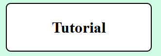

- When the user selects the start button, it will start the game and show the first question.
- The Tutorial pop-up informs users on how to play.

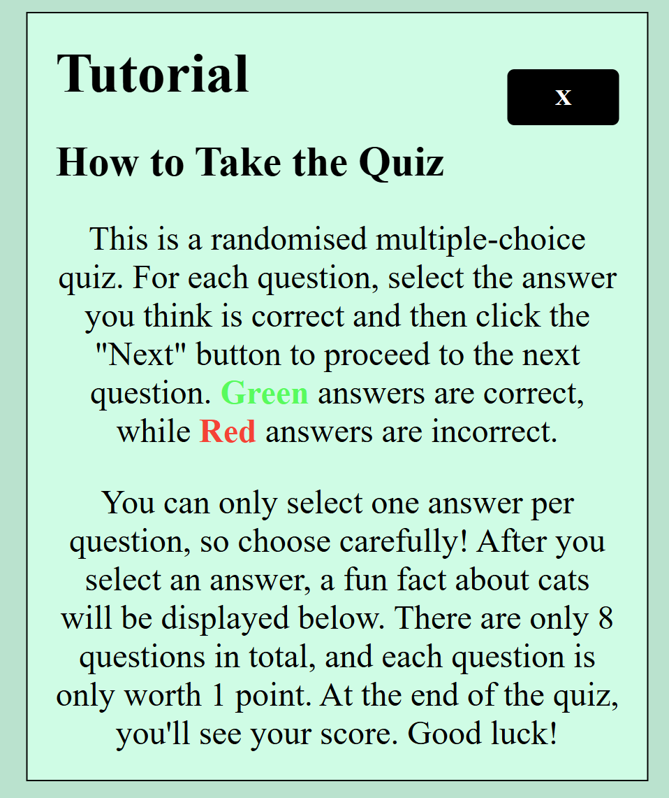

- In the centre of the page, users will see a 'Start' button allowing them to start the game.

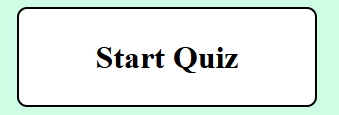

- Once you have completed the quiz you will see your total score as well as a 'Play Again' button allowing users to restart the quiz.

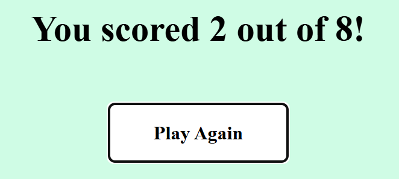

 

# Technologies Used

- VSCode was used as my main tool in order to write/edit code
- Git was used to deal with the version control of my website
- GitHub was used to host the code of my website
- HTML was used as the foundation/structure of my site
- CSS was used to style and edit the layout of my site
- JavaScript was used to create the features, interactivity and visuals required to make my quiz function

 

# Testing

- WIP to be added

 

# Validation

### HTML

During the creation of my website I did encounter errors, for example, in my HTML file I encounted the following error:

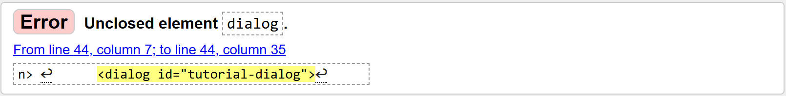

I amended this particular issue by ensuring that my <dialog> tag was closed correctly and placed in the correct location.

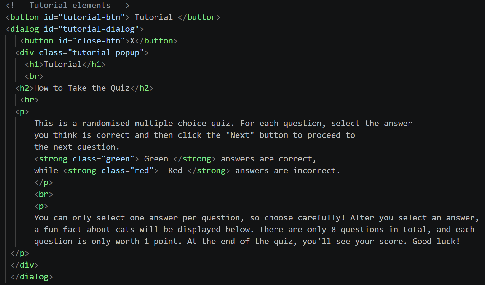

This is how I ensured that my HTML file remained error free.

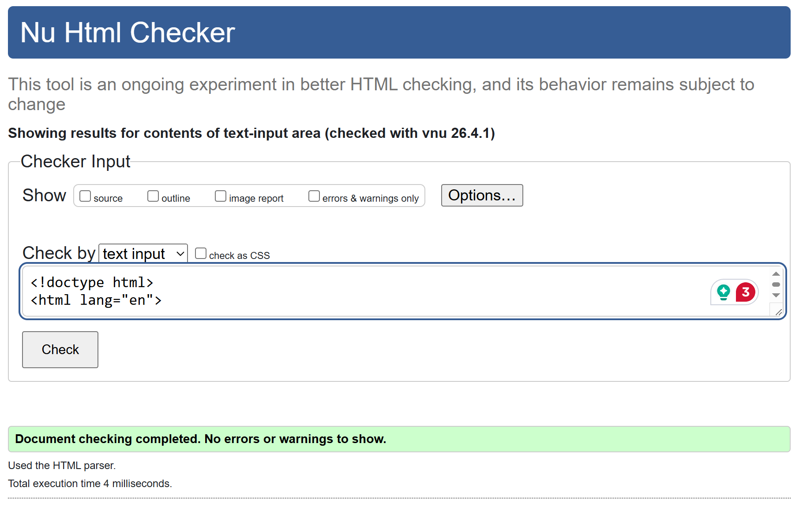

### CSS

Another error I encounted was in my CSS file:

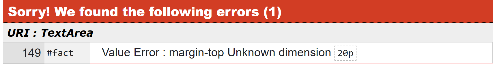

I amended this error by proofreading my CSS file and adding '20px;' in the correct location.

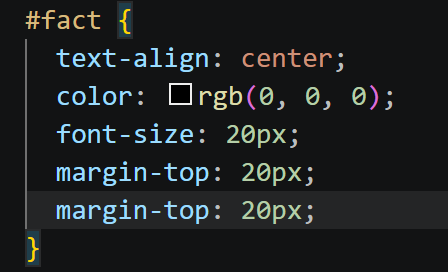

This is how I ensured that my CSS file remained error free.

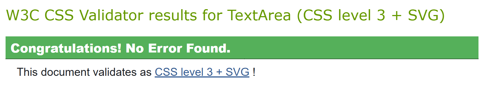

### JS

The final error I encounted was in my JS file:

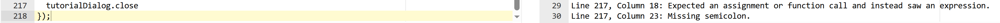

I was able to fix this error by proofreading my JS file and realising 'tutorialDialog.close' at the end of my JS file was inputted incorrectly, please see the amended version below:

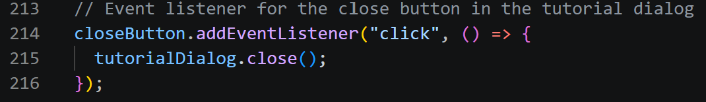

Through the use of various validators I was able to ensure that code was free from errors and efficient.

 

# Accessibility

The website was tested using Lighthouse, please find the report below:

- WIP to be added

# Deployment

- WIP to be added

 

# Credits

Research and information about Cat facts gathered from the following source:

[FactRetriever.com](https://www.factretriever.com/cat-facts)

Code validation was done through the use of the following websites:

[HTML Validator](https://validator.w3.org/nu/#textarea)
[CSS Validator](https://jigsaw.w3.org/css-validator/#validate_by_input)
[JS Validator](https://www.site24x7.com/tools/javascript-validator.html)
